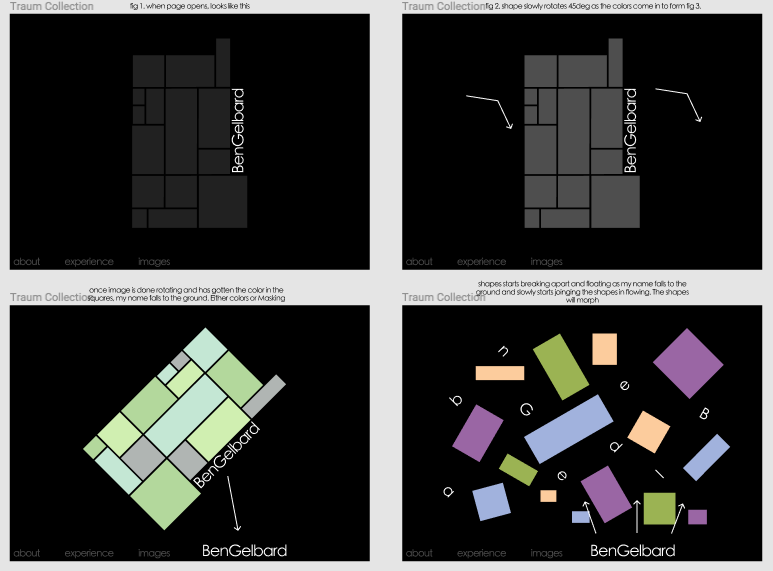
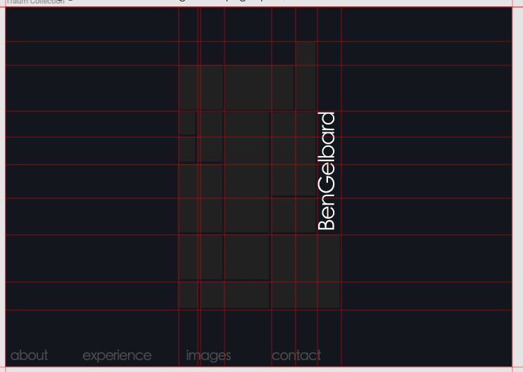
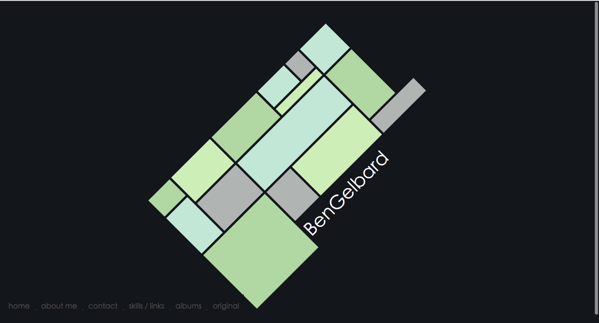
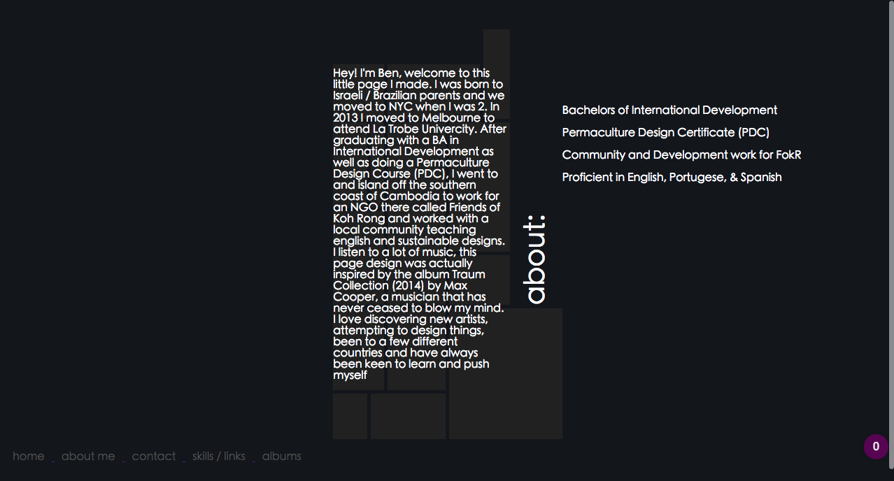
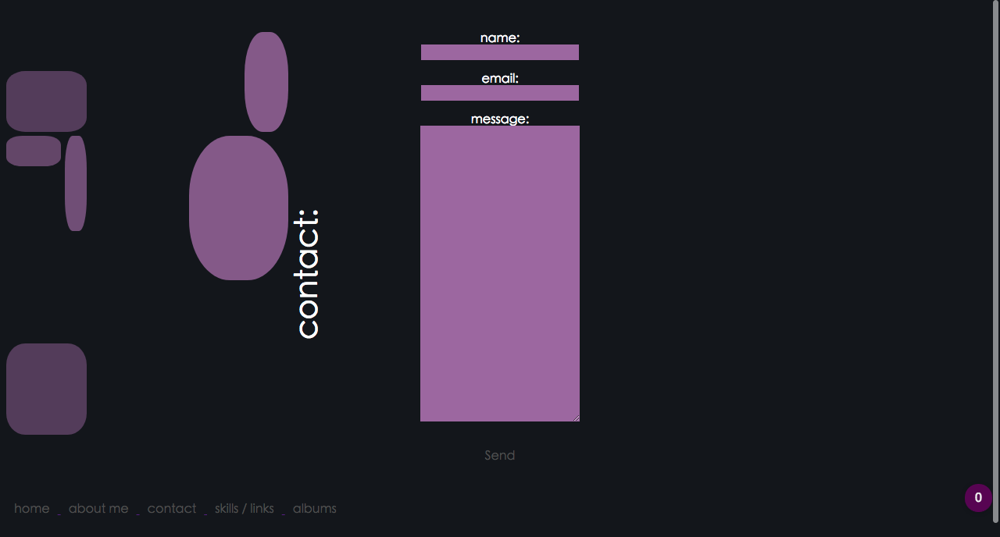
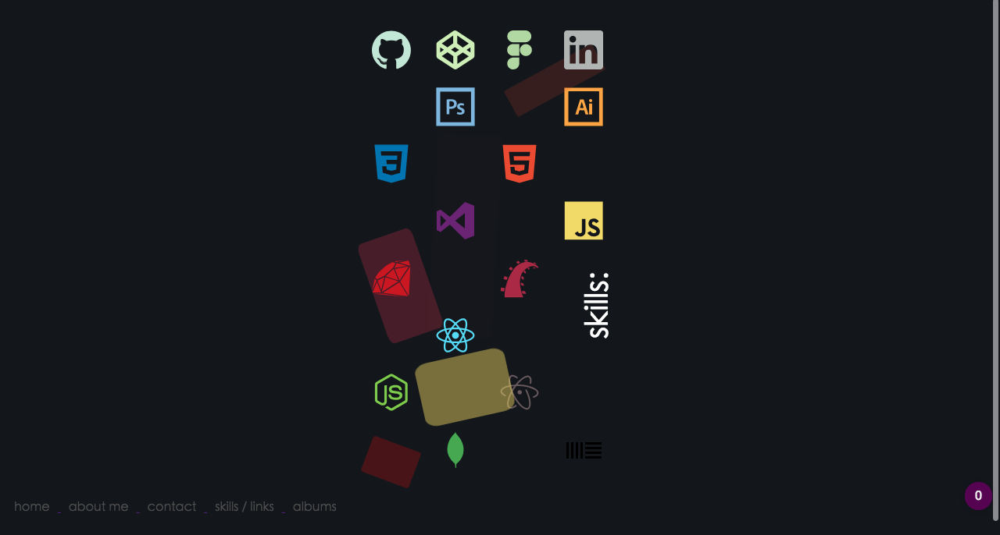
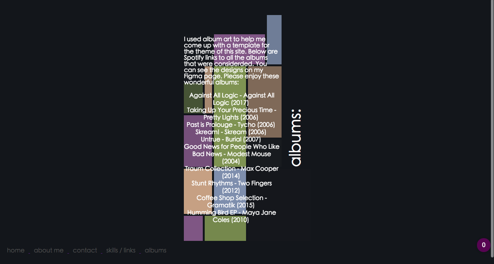
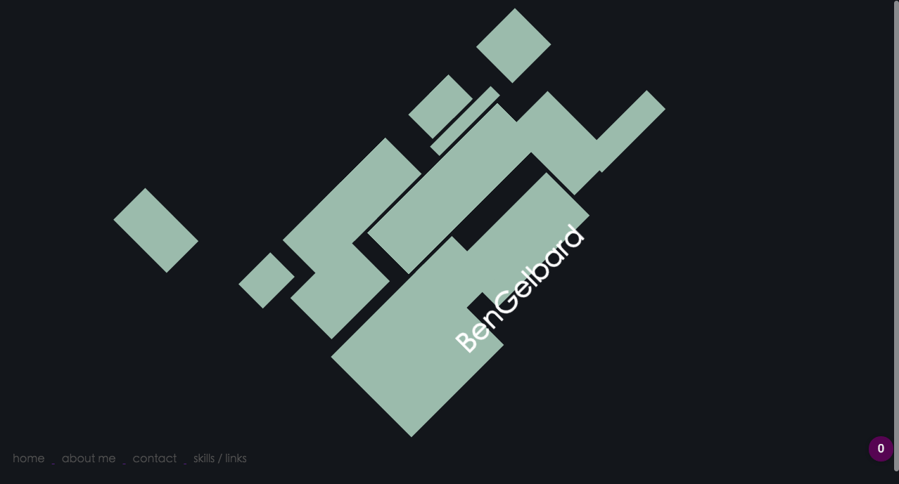

https://www.figma.com/file/cy385CTJCKr4Zolx98a82D6N/Portfolio-Ideas?node-id=74%3A81

http://127.0.0.1:5500/Portfolio_about.html

## Brainstorming

When starting this portfolio I a had no idea what I wanted to do. How was I going to design it, what were my inspirations? After a while of trying to think about what to think about I started browsing my iTunes library to find some music to try to inspire my inspiration, and it hit me. Album covers are art. 

So I started taking inspiration from a few album covers as well as the music on the albums. I came up with a few different templates: 

all these albums are sonically amazing. I eventually settled for one that wasn't even on my original list.

I started this page with one goal (which I was never able to acomplish, at least not the way I intended), and that was to have all the spuares gently float around the screen (sort of like the DVD idle screen) after the main shape rotated. 

it was really hard to get the grid on css to resemble the one created on figma. 

# Site
I really wanted to experement with this site and play around with shapes. The grid feature on css was a lifesavor and this idea would have been a lot harder to pull off if it wasn't for it. 

The site opens up with the intro page showing a little animation with the main shape that is featured throughout the whole site.

there are 6 links at the bottom-left corner of this page: 

1. home - to main page 
2. about me - bio / educational history 
3. contact - contact form 
4. skills / links - dev skills and weblinks 
5. albums - music I like 
6. original - I got the shapes to do what I wanted (kind of) 
   
each page just became a way that I could manipulate this shape, and have it do subtle but vivid animations. I didn't want the movements and colors to be too distraction, more to add a nice visual backdrop for what was being displayed. 

### Describe key events in the development of the internet from the 1980s to today (max. 150 words)

In the 1980's the internet starts being introduced to other areas of the world, with Mike Jensen starting to build networks to connect nonprofit sectors in developing countries to Jaap Akkerhui connecting Europe. At this time Radia Perlman Develops Key Routing Protocols which continues to be used this day, and the Spanning Tree algorithm, which allows the Ethernet to handle large clouds of data. in 1892, Teus Hagen initiates the European Unix Network (EUnet) as the EUUG dial-up service, which becomes the first public wide area network in Europe. In 1991 one of the first webpages appear. In 2003 myspace paves the road for the rise of online social media, and in 2007 apple officially makes the net go mobile. 

### Define and describes the relationship between fundamental aspects of the internet such as: domains, web servers, DNS, and web browsers (max. 150 words)

### Reflect on one aspect of the development of internet technologies and how it has contributed to the world today (max. 150 words)

The endless amounts of ways to stay connected with people from all over the world still baffles me. We have the ability to send messages to anyone in the world at anytime from most locations in the world. It was brought the world closer as everyone you want to talk too is just a click away. It has given birth to new forms of social media and altered our lifestyle as a species. 
